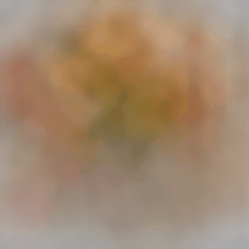
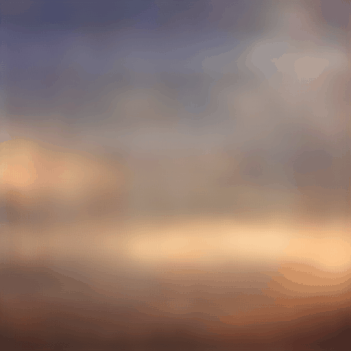
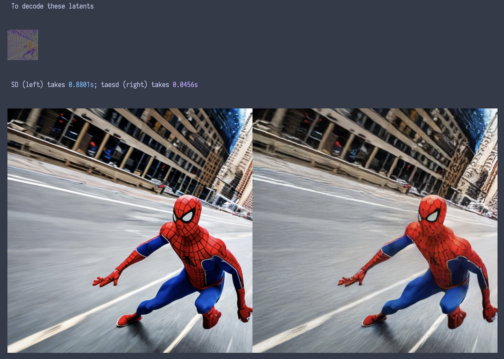
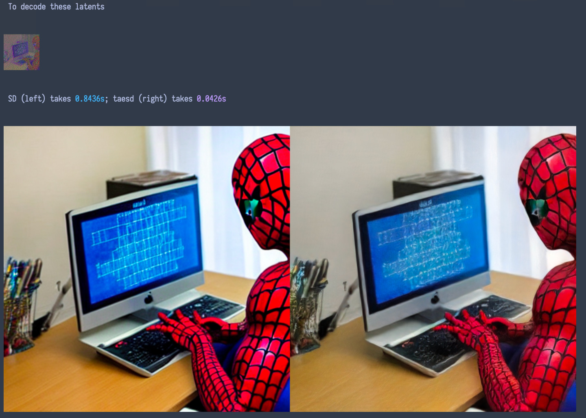
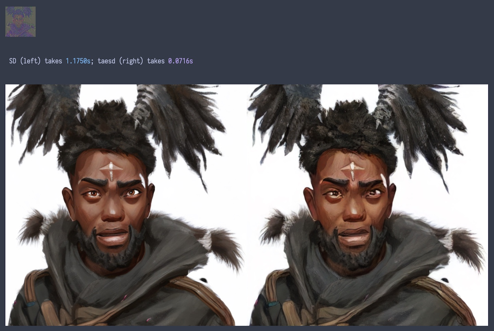
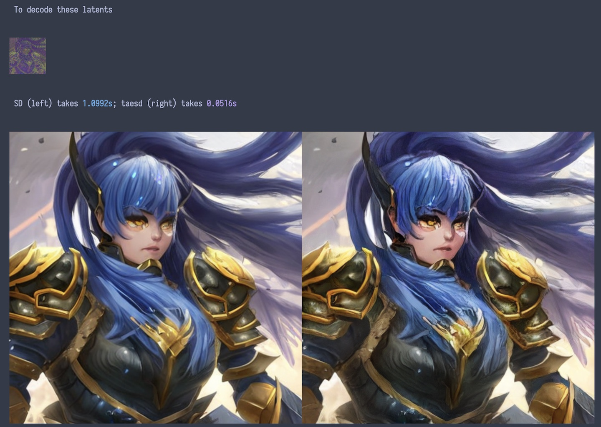
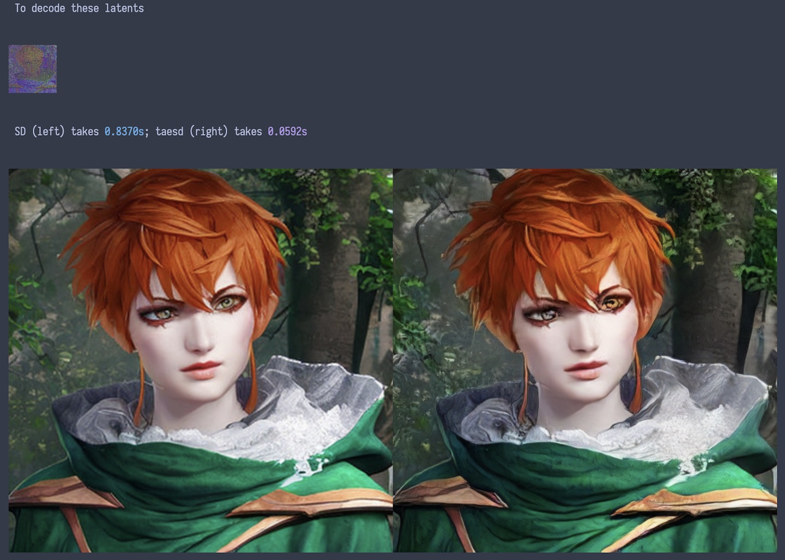

# 🍰 Tiny AutoEncoder for Stable Diffusion

## What is TAESD?

TAESD is very tiny autoencoder which uses the same "latent API" as Stable Diffusion's VAE*. TAESD can decode Stable Diffusion's latents into full-size images at (nearly) zero cost. Here's a comparison on my laptop:

## What can I use TAESD for?

Since TAESD is very fast, you can use TAESD to watch Stable Diffusion's image generation progress in real time.
* Here's a [example notebook](examples/Previewing_During_Image_Generation.ipynb) that adds TAESD previewing to the Diffusers implementation of SD2.1.
* Here's a [PR](https://github.com/AUTOMATIC1111/stable-diffusion-webui/pull/10365/) adding TAESD previewing to the AUTOMATIC1111 WebUI (thanks to [Sakura-Luna](https://github.com/Sakura-Luna)).

|  |  |  |
| -------------------------------- | -------------------------------- | -------------------------------- |

You can also use TAESD for other tasks where the official decoder is [inconvenient](https://twitter.com/cloneofsimo/status/1624134163136933893), like quickly decoding really large images (these examples used the [latent upscaler](https://huggingface.co/docs/diffusers/main/en/api/pipelines/stable_diffusion/latent_upscale)).

|  |  |  |
| --------------------------------- | --------------------------------- | --------------------------------- |

## How does TAESD work?

TAESD is a tiny, distilled version of Stable Diffusion's VAE*, which consists of an encoder and decoder. The encoder turns full-size images into small "latent" ones (with 48x lossy compression), and the decoder then generates new full-size images based on the encoded latents by making up new details.

The original / decoded images are of shape `3xHxW` with values in approximately `[0, 1]`, and the latents are of shape `4x(H/8)x(W/8)` with values in approximately `[-3, 3]`. You can clip and quantize the latents into 8-bit PNGs without much loss of quality. TAESD's latents should look pretty much like Stable Diffusion latents.

Internally, TAESD is a bunch of Conv+Relu resblocks and 2x upsample layers:

## What are the limitations of TAESD?

If you want to decode detailed, high-quality images, and don't care how long it takes, you should just use the original SD VAE* decoder. TAESD is very tiny and trying to work very quickly, so it tends to fudge fine details. Examples:

|  |  |  |
| ------------------------------- | ------------------------------- | ------------------------------- |

|  |  |  |
| -------------------------------------- | ---------------------------------------- | ---------------------------------------- |

TAESD trades a (modest) loss in quality for a (substantial) gain in speed and convenience.

## Comparison table

|                                                              | SD VAE*                                                      | TAESD                                             |
| ------------------------------------------------------------ | ------------------------------------------------------------ | ------------------------------------------------- |
| Parameters in Encoder                                        | 34,163,592                                                   | 1,222,532                                         |
| Parameters in Decoder                                        | 49,490,179                                                   | 1,222,531                                         |
| ONNX Ops                                                     | Add, Cast, Concat, Constant, ConstantOfShape, Conv, Div, Gather, InstanceNormalization, MatMul, Mul, Pad, Reshape, Resize, Shape, Sigmoid, Slice, Softmax, Transpose, Unsqueeze | Add, Constant, Conv, Div, Mul, Relu, Resize, Tanh |
| Runtime / memory scales linearly with size of the latents    | No                                                           | Yes                                               |
| Bounded receptive field so you can split decoding work into tiles without, like, weird seams and stuff | No                                                           | Yes                                               |
| High-quality details                                         | Yes                                                          | No                                                |
| Tiny                                                         | No                                                           | Yes                                               |

---

\* VQGAN? AutoencoderKL? `first_stage_model`? [This thing.](https://github.com/huggingface/diffusers/blob/main/src/diffusers/models/vae.py)
