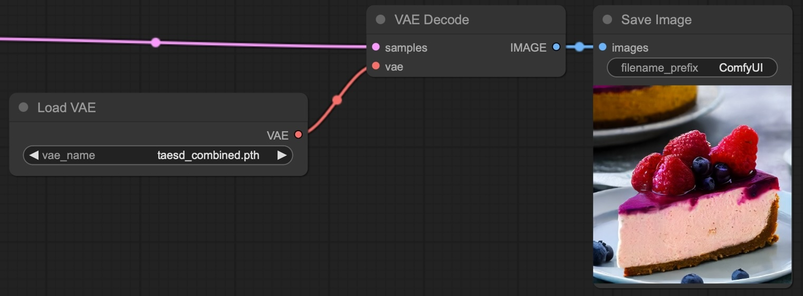

# TAESD ComfyUI Checkpoints

If you want to use TAESD in ComfyUI as a fast, lower-quality standalone VAE, you can use one of these combined checkpoints:
1. Download the combined checkpoint that matches your SD version
    - [taesd_combined.pth](https://github.com/madebyollin/taesd/raw/main/comfyui_checkpoints/taesd_combined.pth) for SD
    - [taesdxl_combined.pth](https://github.com/madebyollin/taesd/raw/main/comfyui_checkpoints/taesdxl_combined.pth) for SDXL
    - [taesd3_combined.pth](https://github.com/madebyollin/taesd/raw/main/comfyui_checkpoints/taesd3_combined.pth) for SD3
2. Place the combined checkpoint into ComfyUI's `models/vae` folder
3. Add a `Load VAE` node and set `vae_name` to the combined checkpoint name
4. Connect the `VAE` output of your `Load VAE` node to the `vae` input of your `VAE Decode` or `VAE Encode` nodes

